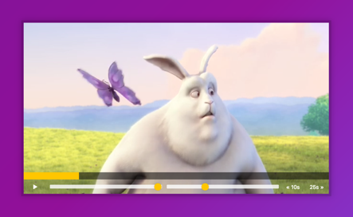

## JavaScript30 Day 11 - Custom Video Player

In this tutorial, we learn how to customize HTML5 video player. This custom video player we have control to adjust the volume, playback speed, skip forward 25s, skip backward 10s and pause and play video when the video screen is clicked.

[View demo site here.](https://webdevtuts.github.io/javascript30_11/)

